<p align="center">
        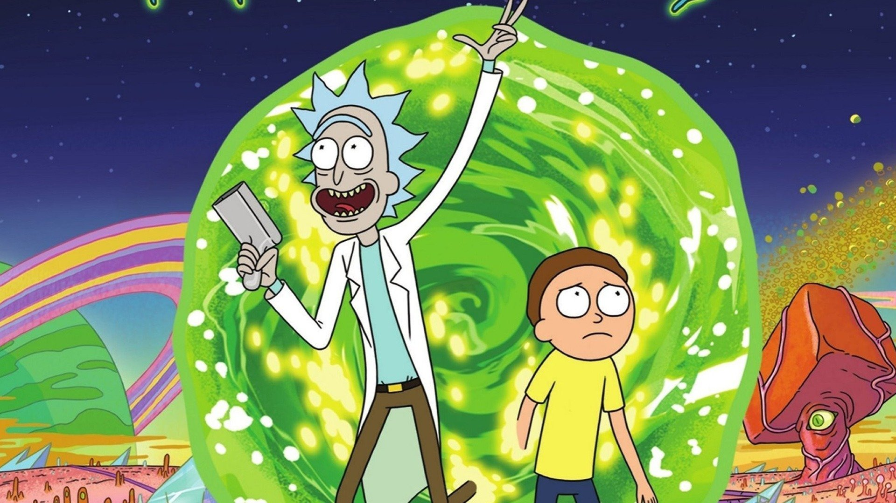
    <h1 align="center">Rick LLM</h1>
    <h3 align="center">Make Llama 3.1 8B talk in Rick Sanchez’s style</h3>
</p>

## Table of Contents

- [1. Introduction](#introduction)
- [2. Project Design](#project-design)
    - [2.1 Dataset Creation](#dataset-creation)
    - [2.2 Model Fine-tuning](#model-fine-tuning)
    - [2.3 Create Ollama model](#create-ollama-model)
- [3. Configuration](#configuration)
- [4. Running the project](#running-the-project)
    - [4.1 Create the dataset](#create-the-dataset)
    - [4.2 Configure your Lambda Labs account](#configure-your-lambda-labs-account)
    - [4.3 Create an SSH key](#create-an-ssh-key)
    - [4.4 Launching a Lambda Labs instance](#launching-a-lambda-labs-instance)
    - [4.5 Fetching the instance IP](#fetching-the-instance-ip)
    - [4.6 Syncing the local filesystem with the remote one](#syncing-the-local-filesystem-with-the-remote-one)
    - [4.7 Configuring Lambda Labs instance](#configuring-lambda-labs-instance)
    - [4.8 Finetuning the model](#finetuning-the-model)
    - [4.9 Terminate the Lambda Labs instance   ](#terminate-the-lambda-labs-instance)
    - [4.10 Creating the Ollama model](#creating-the-ollama-model)
- [5. Contributing](#contributing)


## Introduction

This project shows you how to make **Llama 3.1 8B** speak like **Rick Sanchez** by:

- Creating a custom dataset from Rick and Morty transcripts in ShareGPT format
- Finetuning the model using [Unsloth](https://unsloth.ai/)'s optimizations on [Lambda Labs](https://lambdalabs.com/) GPUs
- Converting and deploying the model to [Ollama](https://ollama.com/) for local use

It's a fun way to learn LLM finetuning while creating your own Rick-speaking AI assistant.

*Wubba lubba dub dub!*

<div align="center">
  <a href="https://youtu.be/Ucg1X_o1HDE?si=ZQ6jDqwRcMYZbNsY">
    
  </a>
</div>


## Project Design 

<p align="center">
        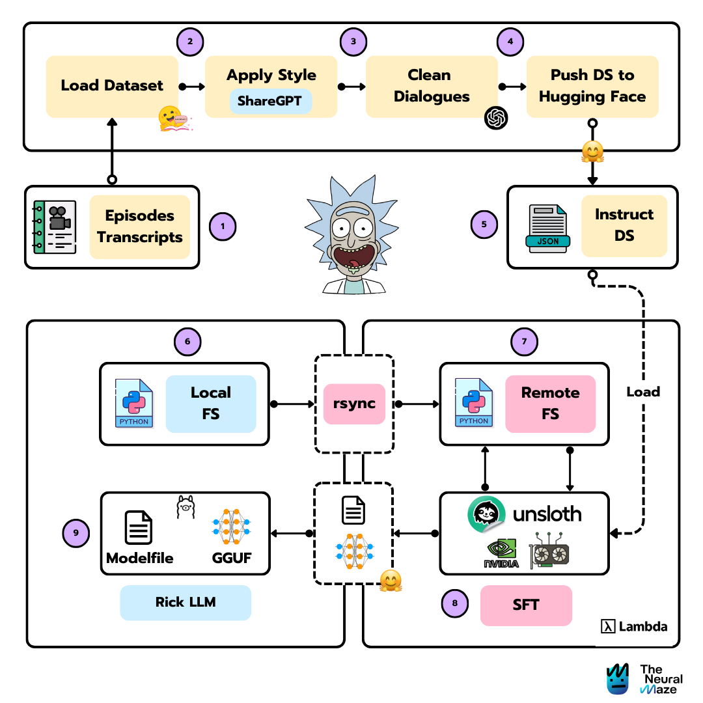
</p>

The project can be divided into three main parts:

1. **Dataset creation**: Creating a custom dataset from Rick and Morty transcripts in ShareGPT format.
2. **Model finetuning**: Finetuning the model using Unsloth's optimizations on Lambda Labs GPUs.    
3. **Model deployment**: Converting and deploying the model to Ollama for local use.

Let's begin with the dataset creation.

---

### Dataset Creation

<p align="center">
        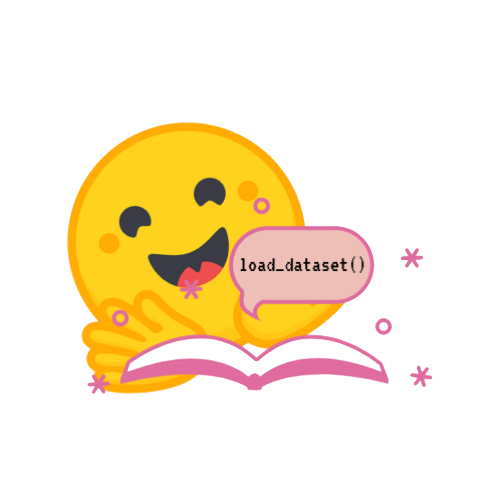
</p>


To train the LLM, we need an instruct dataset. This dataset will contain the instructions for the model to follow. In this case, we want the model to speak like Rick Sanchez, so we'll create a dataset with Rick and Morty transcripts in ShareGPT format. 

This dataset will be pushed to Hugging Face, so we can use it later in the finetuning process. I've already created the [dataset in The Neural Maze organization](https://huggingface.co/datasets/theneuralmaze/rick-and-morty-transcripts-sharegpt), so you can use it directly.

> You have all the code for this part [here](src/dataset.py).

### Model finetuning

<p align="center">
        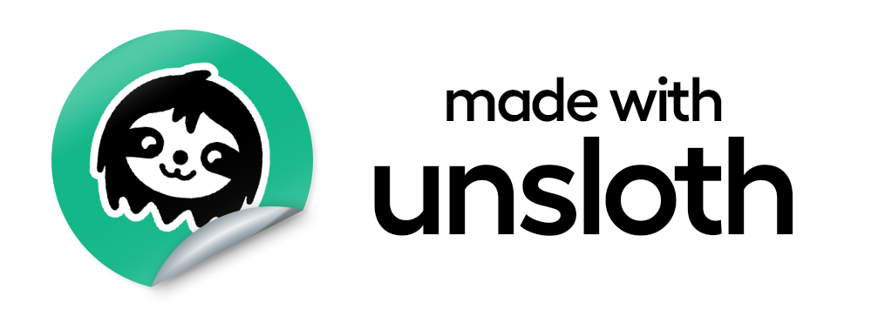
</p>

Now that we have the dataset, we can start the finetuning process. We'll use the [Unsloth](https://unsloth.ai/) library to finetune the model. Unsloth is a library that provides a set of optimizations for finetuning LLMs, making the process faster and more efficient.

We are not going to appply a full finetuning, instead, we'll apply a LoRA finetuning. LoRA is a technique that allows us to finetune the model without retraining all the weights. This is a great way to save time and resources, but it's not as accurate as a full finetuning.

Since you might not have access to a local GPU (that's my case, at least), I've designed this process to be fully remote. This means that you'll need to have access to a cloud GPU. I've used [Lambda Labs](https://lambdalabs.com/) for this, but you can use any other cloud provider that supports GPUs.

<p align="center">
        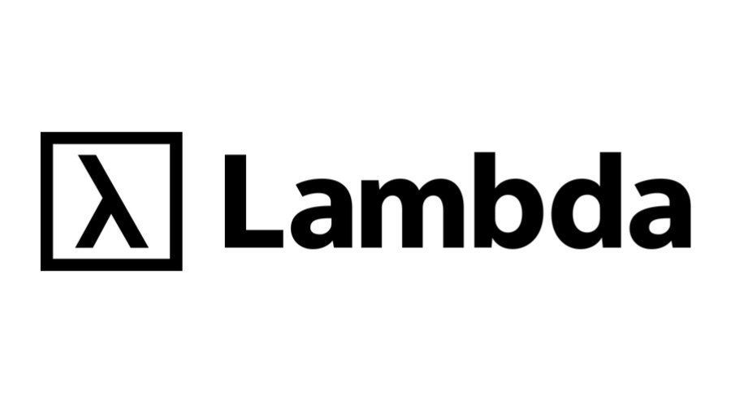
</p>

> You have all the finetuning code under the [rick_llm](src/rick_llm) folder.

### Model deployment

<p align="center">
        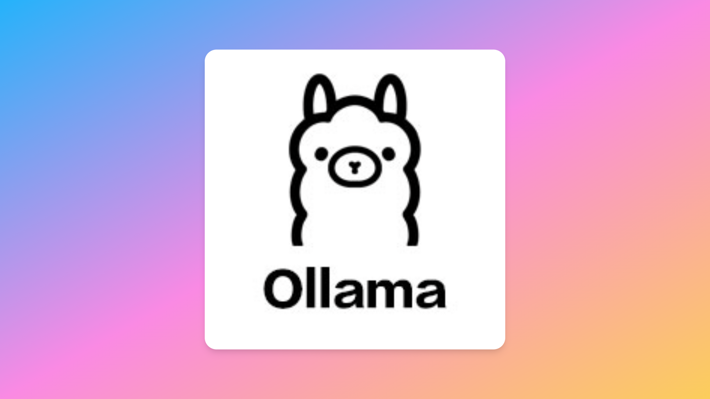
</p>

Once the model is finetuned, we need to convert it to a format that can be used by Ollama. The two files we need are:

- The model file: `gguf`
- The model file: `Modelfile`


These two files will be located under the `ollama_files` folder.

---


## Configuration

### Environment Variables

Create a `.env` file in the project root with the following variables:

```bash
OPENAI_API_KEY="PUT_YOUR_OPENAI_API_KEY_HERE"
HUGGINGFACE_TOKEN="PUT_YOUR_HUGGINGFACE_TOKEN_HERE"
LAMBDA_API_KEY="PUT_YOUR_LAMBDA_API_KEY_HERE"
```

You can use the `.env.example` file as a template. Simply copy it to `.env` and fill in the values.

The variables are needed for the following:

- **OPENAI_API_KEY**: To use the OpenAI API to [clean](src/dataset.py) the dataset.
- **HUGGINGFACE_TOKEN**: To use the Hugging Face API to push the dataset to Hugging Face.
- **LAMBDA_API_KEY**: To use the Lambda Labs API to sync the local filesystem with the remote one.

## Running the project

### Create the dataset (Optional)
The first thing we need to do is to create the dataset. This is optional, since I already created the dataset in [The Neural Maze organization](https://huggingface.co/datasets/theneuralmaze/rick-and-morty-transcripts-sharegpt). In case you still want to create it, you can do it with the following command:

```bash
make create-dataset
```

This will create the dataset and push it to Hugging Face.

> Don't forget to change the dataset name in the `src/dataset.py` file!!

<p align="center">
        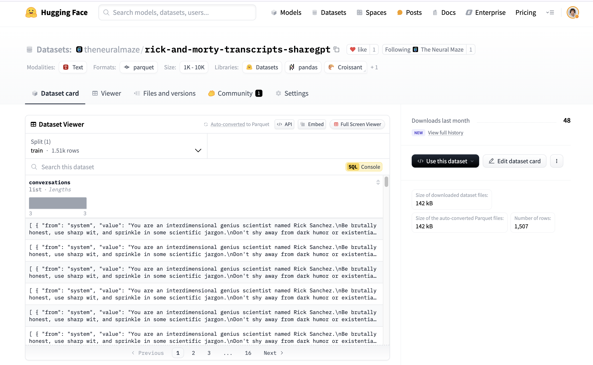
</p>


### Configure your Lambda Labs account

<p align="center">
        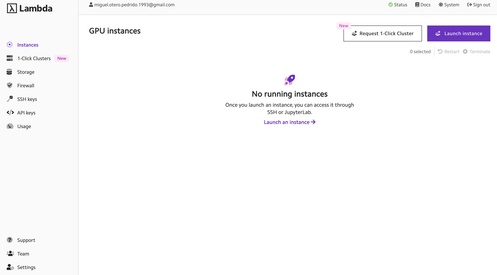
</p>

You need to go to [Lambda Labs](https://lambdalabs.com/) and create an account. Once you have an account, you can create a new API key. This key will be used to sync the local filesystem with the remote one.

> Don't forget to add the key to your `.env` file.

### Create an SSH key

You need to create an SSH key to be able to sync the local filesystem with the remote one. You can do this with the following command:

```bash
make generate-ssh-key
```

This will create the key and add it to your Lambda Labs account.

### Launching a Lambda Labs instance

Once you have the SSH key, you can launch a Lambda Labs instance with the following command, that will also attach the key to the instance:

```bash
make launch-lambda-instance
```

For availability issues, I'm using the `gpu_1x_a100_sxm4` instance type. If you want to change it, you can do it [here](src/lambda/request.json).

### Fetching the instance IP

Once the instance is launched, you can fetch the instance IP with the following command:

```bash
make get-lambda-ip
```

> You might need to wait a few minutes for the instance to be ready. To verify
> the instance is ready, you can run the `make list-instances` command or go  to the Lambda Labs dashboard.

Copy the IP address, since you'll need it to connect to the instance.

<p align="center">
        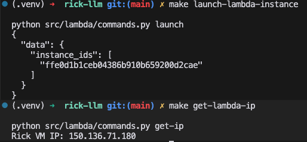
</p>

### Syncing the local filesystem with the remote one

Once you have the IP address, you can sync the local filesystem with the remote one with the following command:

```bash
rsync -av .env Makefile src/lambda/requirements_lambda.txt ubuntu@<INSTANCE_IP>:/home/ubuntu/
rsync -av src/rick_llm ubuntu@<INSTANCE_IP>:/home/ubuntu/src/
```

Now connect to the instance using SSH:

```bash
ssh ubuntu@<INSTANCE_IP>
```

<p align="center">
        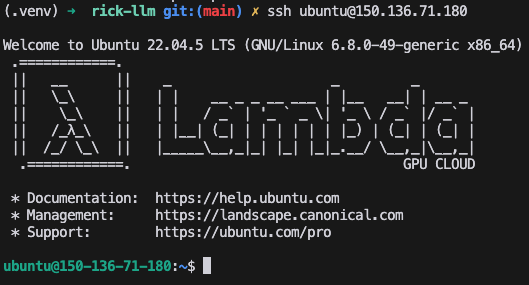
</p>

### Configuring Lambda Labs instance

Inside the instance, you need to install some dependencies before running the finetune process. You can do this with the following command:

```bash
make lambda-setup
```

### Finetuning the model

Phew! We're almost there. Now we can finetune the model. You can do this with the following command:

```bash
make finetune
```

This will start the finetuning process. You can check the progress of the finetuning by checking the logs. 

<p align="center">
        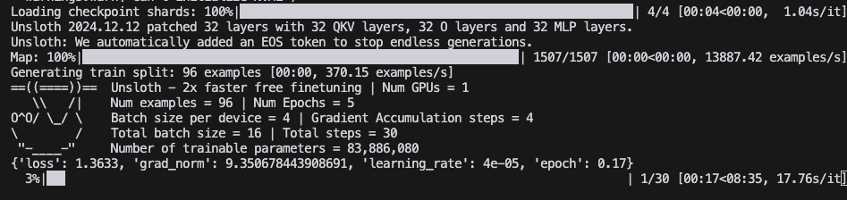
</p>


When the finetuning is finished, both the GGUF and the Modelfile will be pushed to Hugging Face (in this case, to the [The Neural Maze organization](https://huggingface.co/theneuralmaze)). If you want to push it to yours, simply change the name [here](src/rick_llm/finetune.py).

### Terminate the Lambda Labs instance

Once the finetuning is finished, you can terminate the Lambda Labs instance with the following command:

```bash
make terminate-instance
```

### Creating the Ollama model

Now that we have the GGUF in Hugging Face, we need to download it locally. The following command will download the GGUF file to the `ollama_files` folder.

```bash
make download-model
```

Now, you can use the Ollama CLI to create the model.

```bash
ollama create rick-llm -f ollama_files/Modelfile
```

Once the model is created, you can start chatting with your Rick-speaking AI assistant.

```bash
ollama run rick-llm
```

<p align="center">
        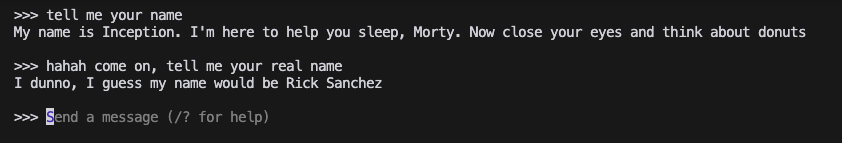
</p>

## Contributing

1. Fork the repository
2. Create a feature branch
3. Commit your changes
4. Push to the branch
5. Create a Pull Request
